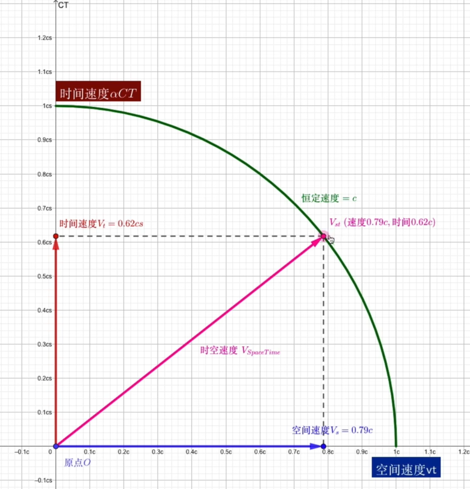

tags:: [[相对论]]
---

- ## 光速不变假设
	- 参考: [我们的上一秒去哪了？从狭义相对论到广义相对论，理解时间究竟是什么](https://www.bilibili.com/video/BV1oC4y1k7iT/?vd_source=f1fbb083ddef12dcff3388779faac201)
	- 即 在所有 [[惯性参考系]] 中, **真空** 中的光速都是一个常数  `c` ，约为: `3×10e8 m/s` .
		- ==非 **惯性参考系** , 由 [[广义相对论]] 解释==
	- 注意:
		- 任何物体的速度, 都基于一个参考系, **光速不变** 的含义就是,  在任何 **惯性参考系** 中的 **真空光速** , 都是常数 `c` .
		  logseq.order-list-type:: number
			- 即 每个观察者测出来的光速都是 `c` .
		- 非真空中的 **光** 的速度, 可能不会等于 `c` , 但这不影响 **光速不变假设** 说的是真空情况.
		  logseq.order-list-type:: number
		- 光速 `c` 不只是真空中的光速, 它还是: **宇宙中的最高速度** .
		  logseq.order-list-type:: number
		- 光速不变是狭义相对论的假设, 起初并非科学事实, 只是后面不断被实验证明.
		  logseq.order-list-type:: number
			- 参考: [相对论！光速不变根本就没有“证明”？！](https://www.bilibili.com/video/BV1hJ411P7Wi/?vd_source=f1fbb083ddef12dcff3388779faac201) ==可以看他一系列视频, 感觉比其他科普更严谨==
- ## 麦克斯韦方程
	- 麦克斯韦方程, 最终推导出:
		- 真空电磁波速度 $v=1/\sqrt{μ0​ε0}​​$
		- 实验发现, 这个速度就是光速 `c` .
		- 光是一种电磁波.
	- 注意:
		- 这个值的推导, 是不基于任何参考系的.
		  logseq.order-list-type:: number
		- 这个推导不能证明光速不变.
		  logseq.order-list-type:: number
- ## 相对性
	- 参考: [高中老师也能讲相对论？能讲，但只能讲一点点](https://www.bilibili.com/video/BV1JF9ZYqE27/?vd_source=f1fbb083ddef12dcff3388779faac201)
	- ==相对性:==
		- 同时的相对性
		  logseq.order-list-type:: number
		- 时间间隔的相对性
		  logseq.order-list-type:: number
			- ==钟慢效应==
			- ==双生子佯谬==
			- 运动的物体时间流速更慢.
		- 长度的相对性.
		  logseq.order-list-type:: number
			- ==尺缩效应==
	- 经典时空观:
		- 时间和空间与运动无关
	- 相对论时空观:
		- 时间和空间与运动有关.
		- 每个物体都有自己独立的时空, 当两个物体相对静止时, 才共享同一时空.
- ## 四维时空
	- 参考: [真.四维！给你看看真正的四维时空！](https://www.bilibili.com/video/BV1SJ41137qM/?vd_source=f1fbb083ddef12dcff3388779faac201)
	- ==四维时空 = 三维空间 + 时间==
	- 我们三维空间的速度, 是四维时空速度在三维空间的投影.
	  id:: 69f6fbae-50c4-4acd-8f11-bc05553db6d7
	- 而任何物体的四维时空速度, 恒为光速 `c` .
	- {:height 450, :width 440}
- ## 参考
	- logseq.order-list-type:: number
	- logseq.order-list-type:: number