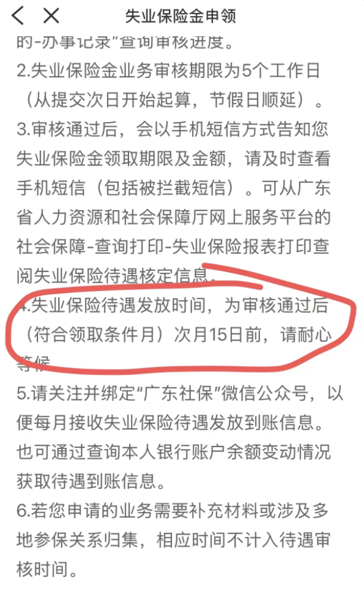

tags:: [[失业保险]]
---

- ## 申领要求
	- 失业前用人单位和本人已经缴纳失业保险费满一年的；
	  logseq.order-list-type:: number
	- 非因本人意愿中断就业的；
	  logseq.order-list-type:: number
	- 已经进行失业登记，并有求职要求的。
	  logseq.order-list-type:: number
- ## 申领后是否导致社保断缴
	- ==不会导致断缴==
	- 领取失业保险金期间:
		- 基本 [[医疗保险]] : 由 **失业保险基金** 支付, 个人无需支付
		  logseq.order-list-type:: number
		- 基本 [[生育保险]] : 由 **失业保险基金** 支付, 个人无需支付
		  logseq.order-list-type:: number
		- 基本 [[养老保险]] : 可以自缴 (选择 **失业人员灵活就业** , [[失业人员灵活就业参保]] )
		  logseq.order-list-type:: number
		- ==失业不能缴纳 [[失业保险]] , 有工作时由企业全额缴纳 [[工伤保险]]==
		  logseq.order-list-type:: number
		-
- ## 深圳申领失业保险金
	- ### 申领失业保险金步骤
		- 进行 **失业登记** .
		  logseq.order-list-type:: number
		- **失业登记** 通过后, 进行 **失业保险金** 申领.
		  logseq.order-list-type:: number
		- 每个月需要办理 **失业保险金资格核对手续** , 否则不再发放.
		  logseq.order-list-type:: number
			- 进入 **粤省事 APP** -> 搜索 **失业保险金资格核对手续** -> 点击 **开始办理** -> 点击 **我承诺遵守上述内容** -> 人脸验证 -> 资格核对
			- 参考: [失业保险金每月领取  需要每月签到 - 杨美丽](https://www.xiaohongshu.com/discovery/item/66fd6813000000002c0150ce?source=webshare&xhsshare=pc_web&xsec_token=ABwOWaMIlsr8RT5c7T_D-q23Z9VcIoS2zP1h91RxTJltQ=&xsec_source=pc_share)
	- ### 失业保险金发放时间
		- 失业保险金的发放时间， 为 **每个符合领取条件月** 的 **次月 15 日** 前。
			- {:height 414, :width 187}
			- ==亲测，2026.06.10，发放 5 月的失业保险金。==
	- ### 查看失业保险金发放记录
		- 进入 **粤省事 APP** -> 搜索 **个人待遇明细查询（失业保险）**
- ## 再次入职需怎么处理
	-
- ## 参考
	- [中华人民共和国社会保险法 - 第五章 失业保险](https://www.mohrss.gov.cn/xxgk2020/fdzdgknr/zcfg/fl/202011/t20201102_394629.html)
	  logseq.order-list-type:: number
	- logseq.order-list-type:: number