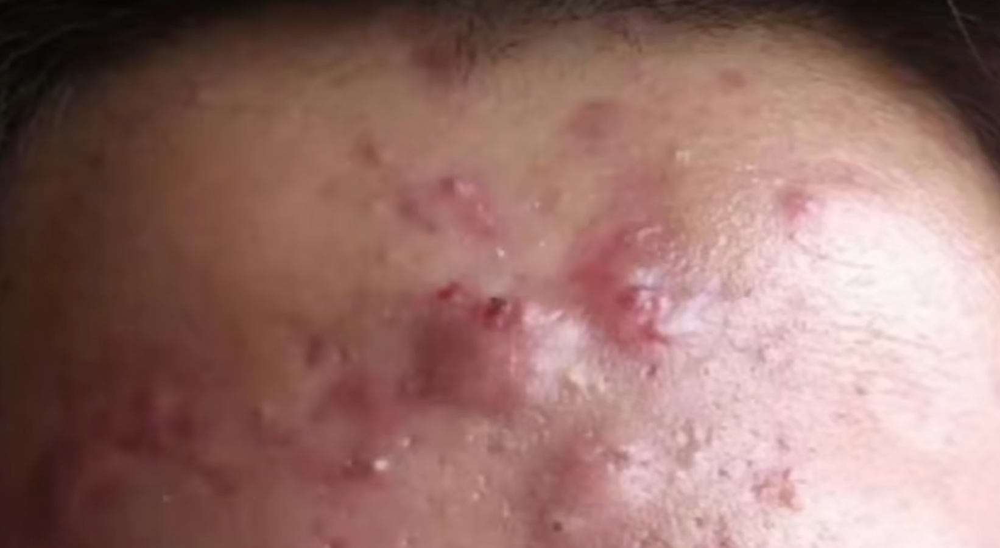

tags:: [[痘痘]]
---

- ## 特征
	- {:height 250, :width 366}
- ## 形成原因
	- 放任 [[痘痘: 脓包]] 不管, 伤害到 **真皮层** .
- ## 治疗须知
	- 治疗难度大, 治疗费用高, 治疗周期长.
	  logseq.order-list-type:: number
	- 治疗需要忍受不小的痛苦.
	  logseq.order-list-type:: number
	- 治疗之后, 会留下 [[痘坑]], **痘疤** 这类 **瘢痕** .
	  logseq.order-list-type:: number
- ## 如何治疗
	- 药物 + 激光 + 功效性护肤品
	- 所以一定要在痘痘早期就医.
- ## 参考
	- [【皮肤科】全类型痘痘攻克指南](https://www.bilibili.com/video/BV17i4y1w7a5/?vd_source=f1fbb083ddef12dcff3388779faac201)
	  logseq.order-list-type:: number
	- [医学博士：如何才能清除痘痘 I 青春痘是怎么来的？I 解决你的痘痘困扰](https://www.bilibili.com/video/BV1EZ4y1x7XQ/?vd_source=f1fbb083ddef12dcff3388779faac201)
	  logseq.order-list-type:: number