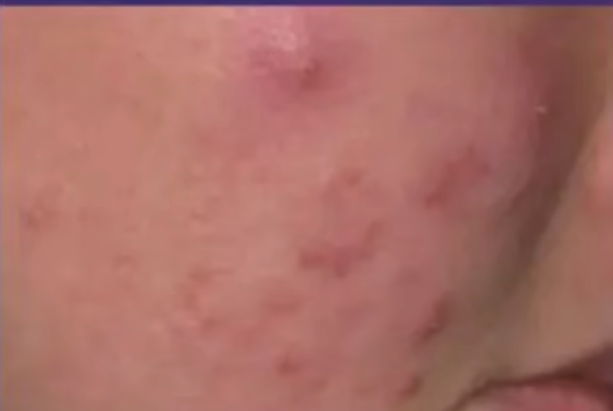
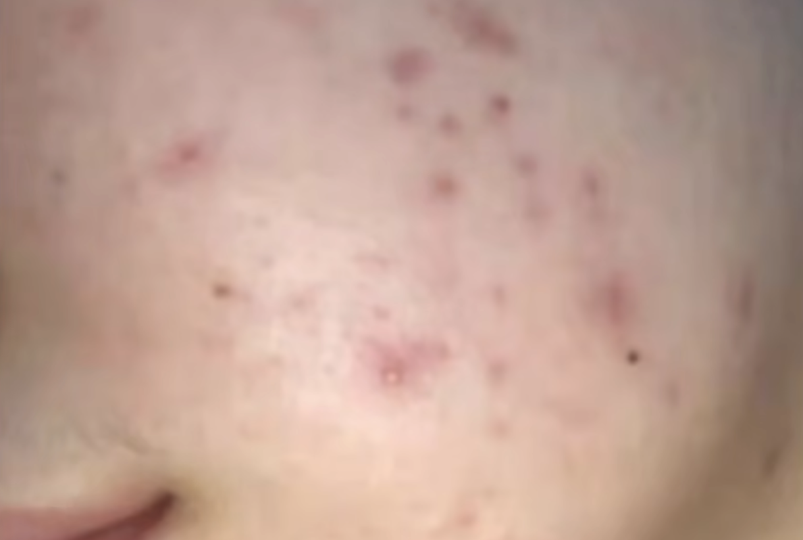

tags:: [[痘痘]]
---

- ## 特征
	- {:height 204, :width 288}
	- {:height 199, :width 289}
- ## 形成原因
	- 在已有 [[痘痘: 粉刺]] 的基础上,  **痤疮丙酸杆菌** 等微生物增殖, 会引发 **炎症** , 从而出现 **炎症丘疹** .
- ## 如何处理
	- 总结就是三点:
		- 疏通毛孔
		  logseq.order-list-type:: number
		- 控制出油
		  logseq.order-list-type:: number
		- 抗炎杀菌.
		  logseq.order-list-type:: number
	- 所以, 就是在处理 [[痘痘: 粉刺]] 的基础上, 加上 **抗炎杀菌** 类药物.
	- **抗炎杀菌** 类药物:
		- 过氧苯甲酰凝胶.
		  logseq.order-list-type:: number
		- 夫西地酸乳膏.
		  logseq.order-list-type:: number
		- 克林霉素凝胶 (属于抗生素).
		  logseq.order-list-type:: number
- ## 参考
	- [【皮肤科】全类型痘痘攻克指南](https://www.bilibili.com/video/BV17i4y1w7a5/?vd_source=f1fbb083ddef12dcff3388779faac201)
	  logseq.order-list-type:: number
	- [医学博士：如何才能清除痘痘 I 青春痘是怎么来的？I 解决你的痘痘困扰](https://www.bilibili.com/video/BV1EZ4y1x7XQ/?vd_source=f1fbb083ddef12dcff3388779faac201)
	  logseq.order-list-type:: number
-