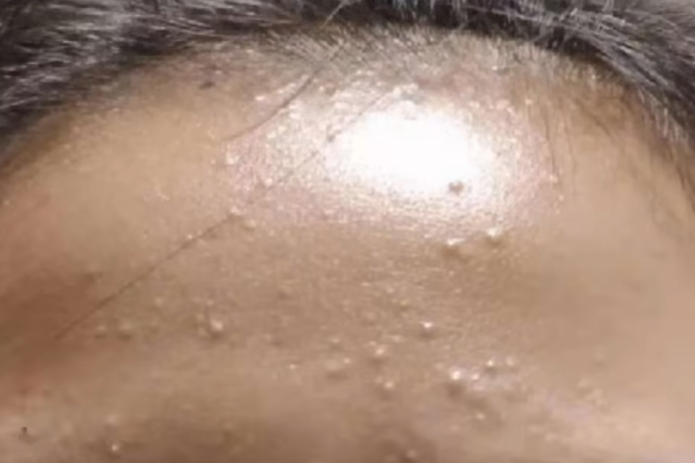
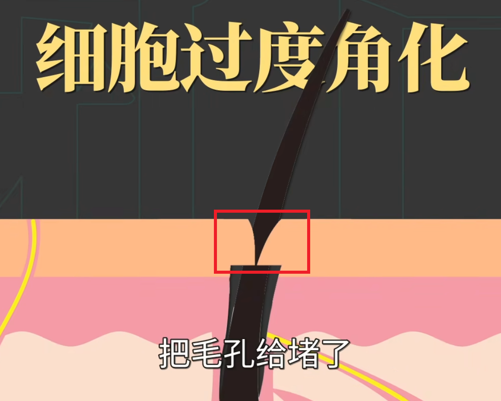
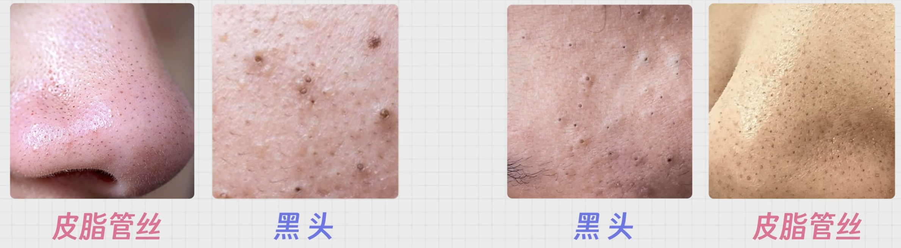

tags:: [[痘痘]]
---

- ## 特征
	- {:height 198, :width 282}
- ## 根本原因
	- 其实就是: **毛孔堵塞** , **皮脂混合物** 分泌不出去, 进而导致皮肤 **隆起小包** .
	- 所以总结就是两点:
		- 毛孔堵塞. (出口堵了)
		  logseq.order-list-type:: number
		- 皮脂过度分泌. (里面东西太多)
		  logseq.order-list-type:: number
- ## 毛孔堵塞
	- **毛孔堵塞** 的主要原因:
		- 毛囊口角质形成细胞 **过度角化** .
		- {:height 187, :width 237}
	- **过度角化** 的原因有：
		- 外部 刺激.
		  logseq.order-list-type:: number
			- 比如化妆品中的某种成分 .
		- 自身 **皮脂** 分泌过多, 导致 **痤疮丙酸杆菌** 等微生物滋生, 将 **皮脂** 中的 **甘油三酯** 分解为 **游离脂肪酸** , 刺激细胞 **过度角化** .
		  logseq.order-list-type:: number
			- 所以油皮容易长痘 .
- ## 皮脂过度分泌
	- 皮脂过度分泌, 混合其他物质, 堵塞了毛孔深部, 导致皮肤隆起小包 .
	- **皮脂过度分泌** 的原因:
		- 皮肤过干
		  logseq.order-list-type:: number
			- 可能是 过度清洁/不保湿 导致.
		- 雄性激素水平过高.
		  logseq.order-list-type:: number
			- 可能原因是:
				- 青春期.
				  logseq.order-list-type:: number
				- 睡眠不足
				  logseq.order-list-type:: number
				- 情绪不好 (焦虑压力)
				  logseq.order-list-type:: number
				- 高糖/高油高脂/乳制品 食物
				  logseq.order-list-type:: number
		- 遗传
		  logseq.order-list-type:: number
			- 基因里就是皮脂分泌多.
- ## 黑头粉刺与闭口粉刺
	- 如果毛孔堵塞位置的 **皮脂混合物** 能与外界接触 **氧化** , 就会变成 **黑头粉刺** , 简称 **黑头** .
	- 如果不能, 就是 **闭口粉刺** 也叫 **白头** .
- ## 黑头与皮脂管丝
	- 参考: [5分钟带你区分：粉刺，闭口，白头，黑头，痘痘，皮脂管丝](https://www.bilibili.com/video/BV1s7V6zgE6A/?vd_source=f1fbb083ddef12dcff3388779faac201)
	- **皮脂管丝** 很常见, 出油就难以避免.
	- **皮脂管丝**  通常比 **黑头** 更小, 颜色更浅.
	- {:height 244, :width 587}
- ## 处理方式
	- 总结就两点:
		- 疏通毛孔.
		  logseq.order-list-type:: number
			- 即 清除角质, 并阻止过度角化.
		- 控制出油.
		  logseq.order-list-type:: number
			- 即 清除皮脂, 并阻止皮脂过度分泌.
- ## 疏通毛孔
	- 使用含如下成分的 **外用药** , 以 **溶解角质** .
	  logseq.order-list-type:: number
		- 维 A 酸.
		  logseq.order-list-type:: number
			- 维 A 酸乳膏.
			  logseq.order-list-type:: number
			- 阿达帕林凝胶.
			  logseq.order-list-type:: number
		- 果酸
		  logseq.order-list-type:: number
		- 水杨酸
		  logseq.order-list-type:: number
		- 壬二酸
		  logseq.order-list-type:: number
	- 通过手术 (如 **针清**) **物理清除角质**
	  logseq.order-list-type:: number
		- 最好去医院处理.
- ## 控制出油
	- 使用含如下成分的 **外用药** , 以 **抑制皮脂分泌** .
		- 维 A 酸.
		  logseq.order-list-type:: number
			- 维 A 酸乳膏.
			  logseq.order-list-type:: number
			- 阿达帕林凝胶.
			  logseq.order-list-type:: number
		- 水杨酸
		  logseq.order-list-type:: number
		- 壬二酸
		  logseq.order-list-type:: number
- ## 日常护理
	- 适度清洁.
	  logseq.order-list-type:: number
		- 注意, 过度清洁只会出更多油.
		- 氨基酸洗面奶.
	- 合理保湿.
	  logseq.order-list-type:: number
		- 皮肤太干, 会导致分泌更多油脂来保护皮肤.
		- 润肤乳
	- 严格防晒.
	  logseq.order-list-type:: number
		- 因为紫外线会:
			- 刺激出油.
			  logseq.order-list-type:: number
			- 让皮脂氧化, 形成黑头.
			  logseq.order-list-type:: number
			- 破坏皮肤屏障, 诱发炎症反应.
			  logseq.order-list-type:: number
			- 刺激角质层变厚, 以 "自我防御" .
			  logseq.order-list-type:: number
			- 导致黑色素沉积增加, 痘印变深.
			  logseq.order-list-type:: number
		- 每天两次防晒霜.
	- 保持良好生活习惯.
	  logseq.order-list-type:: number
		- 作息规律
		  logseq.order-list-type:: number
		- 远离负面情绪.
		  logseq.order-list-type:: number
		- 少吃 高糖/高油高脂/乳制品 食物.
		  logseq.order-list-type:: number
- ## 参考
	- [【皮肤科】全类型痘痘攻克指南](https://www.bilibili.com/video/BV17i4y1w7a5/?vd_source=f1fbb083ddef12dcff3388779faac201)
	  logseq.order-list-type:: number
	- [医学博士：如何才能清除痘痘 I 青春痘是怎么来的？I 解决你的痘痘困扰](https://www.bilibili.com/video/BV1EZ4y1x7XQ/?vd_source=f1fbb083ddef12dcff3388779faac201)
	  logseq.order-list-type:: number
	- [“医生，我痘上长了个脸…” ——呃…其实没有治不好的痘｜皮肤科医生教你祛痘让你拥有高质量人类肌肤](https://www.bilibili.com/video/BV1kP4y1x7as/?vd_source=f1fbb083ddef12dcff3388779faac201)
	  logseq.order-list-type:: number