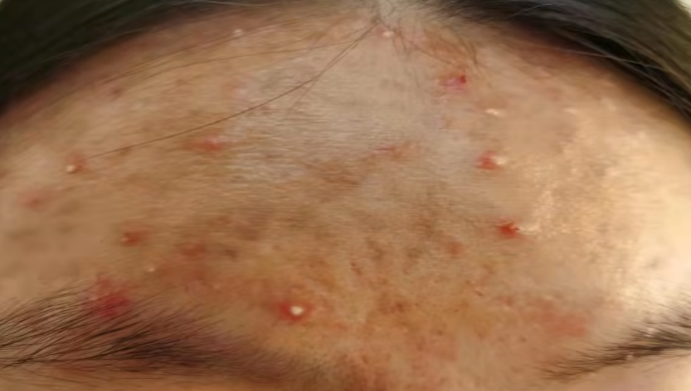

tags:: [[痘痘]]
---

- ## 特征
	- {:height 286, :width 363}
- ## 形成原因
	- 放任 [[痘痘: 炎症丘疹]] 不管, 继而发展为 **脓包** .
- ## 如何处理
	- 在处理  [[痘痘: 炎症丘疹]]  的基础上, 配合一些口服药物:
		- 异维 A 酸 类
		  logseq.order-list-type:: number
		- 米诺环素 类
		  logseq.order-list-type:: number
	- 一般来说, 此时治疗还不算晚, 虽然痘印少不了, 但是很难留下 [[痘坑]] 这类不可逆的 **瘢痕**.
- ## 参考
	- [【皮肤科】全类型痘痘攻克指南](https://www.bilibili.com/video/BV17i4y1w7a5/?vd_source=f1fbb083ddef12dcff3388779faac201)
	  logseq.order-list-type:: number
	- [医学博士：如何才能清除痘痘 I 青春痘是怎么来的？I 解决你的痘痘困扰](https://www.bilibili.com/video/BV1EZ4y1x7XQ/?vd_source=f1fbb083ddef12dcff3388779faac201)
	  logseq.order-list-type:: number