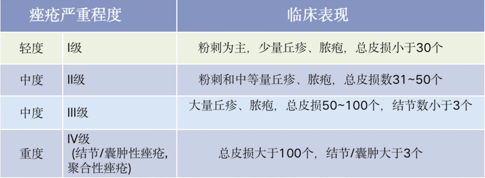

tags:: [[护肤]]
---

- **痘痘** , 是一种寻常型的 **痤疮** .
- ## 学习路线
	- [[皮肤结构]]
	  logseq.order-list-type:: number
	- 痘痘的几个阶段:
	  logseq.order-list-type:: number
		- 成长期: 粉刺 (参见: [[痘痘: 粉刺]])
		  logseq.order-list-type:: number
		- 成熟期: 炎症丘疹 (参见: [[痘痘: 炎症丘疹]])
		  logseq.order-list-type:: number
		- 完全体: 脓疱  (参见: [[痘痘: 脓疱]])
		  logseq.order-list-type:: number
		- 究极体: 囊肿结节  (参见: [[痘痘: 囊肿结节]])
		  logseq.order-list-type:: number
	- 痘痘分级:
	  logseq.order-list-type:: number
		- {:height 205, :width 454}
	- [[痘坑]]
	  logseq.order-list-type:: number
	- [[痘痘外用药]]
	  logseq.order-list-type:: number
	- [[痘印]], 痘疤
	  logseq.order-list-type:: number
	- [中国痤疮治疗指南（2019 修订版）](https://medi-guide.meditool.cn/ymtpdf/6A46D2DD-198E-AD24-47DD-328C1B791C82.pdf)
	  logseq.order-list-type:: number
-