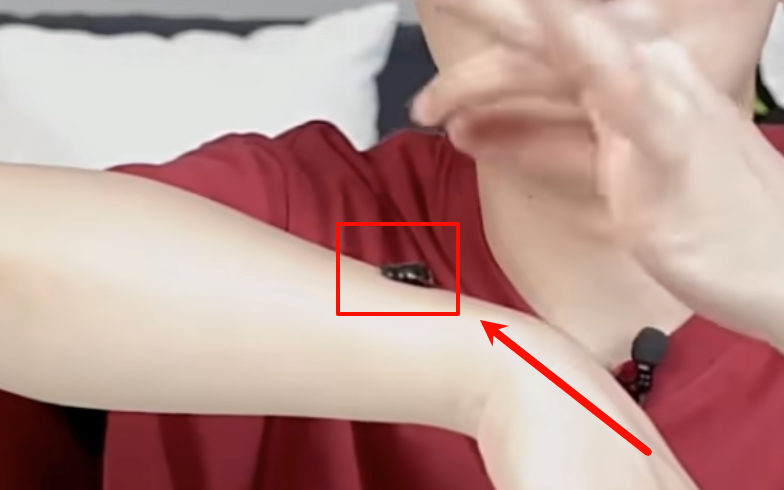

tags:: [[痘痘]]
---

- ## 维 A 酸类
	- ### 常见药膏
		- 阿达帕林凝胶
		  logseq.order-list-type:: number
		- 维 A 酸乳膏
		  logseq.order-list-type:: number
	- ### 对哪些情况见效
		- 对如下都见效:
			- [[痘痘: 粉刺]] (黑头和白头都可)
			  logseq.order-list-type:: number
			- [[痘痘: 炎症丘疹]]
			  logseq.order-list-type:: number
			- [[痘印]]
			  logseq.order-list-type:: number
	- ### 注意事项
		- 局部点涂使用
		  logseq.order-list-type:: number
			- 使用棉签在痘痘上点涂, 也不用揉得特别开
		- 仅夜间使用.
		  logseq.order-list-type:: number
			- 仅在夜间使用, 早上起床后洗掉, 否则见光可能导致 **皮肤变黑** , 以及加重刺痛过敏 (如果过敏的话).
		- 注意保湿和防晒.
		  logseq.order-list-type:: number
		- 备孕期, 孕期 和 哺乳期禁用.
		  logseq.order-list-type:: number
	- ### 维 A 酸乳膏
		- #### 浓度选择
			- 浓度一般分为 `0.025%` 和 `0.1%` .
			- 如果是以下情况之一, 先从 `0.025%` 开始使用:
				- 第一次用
				  logseq.order-list-type:: number
				- 年龄较小
				  logseq.order-list-type:: number
				- 皮肤相对薄嫩, 容易受刺激
				  logseq.order-list-type:: number
			- 如果使用 `0.025%` 效果一般 (比如 痘痘比较严重的时候), 可以尝试过渡到 `0.1%` .
		- #### 关于过敏
			- 一部分人使用可能出现 刺痛 或 早起脱皮 的过敏反应.
			- 如果出现过敏, 可以隔几天再使用:
				- 如果症状减轻, 可以缩短间隔天数, 再继续使用; 最后变成每晚使用. (其实就是建立耐受的过程)
				- 如果症状没有减轻, 则可能无法建立耐受, 可以选择:
					- 停止使用, 或降低浓度使用.
					  logseq.order-list-type:: number
					- 使用阿达帕林凝胶.
					  logseq.order-list-type:: number
	- ### 阿达帕林凝胶
		- 目前比较火, 因为它属于第三代 维 A 酸 :
			- 比较温和, 过敏风险较小.
			  logseq.order-list-type:: number
			- 光敏性弱, 见光后不易出现明显色沉.
			  logseq.order-list-type:: number
	- ### 过氧苯甲酰
		- #### 作用
			- 通过局部缓慢释放单态氧, 杀灭痤疮丙酸杆菌.
			  logseq.order-list-type:: number
			- 抑制油脂分泌
			  logseq.order-list-type:: number
			- 有一定剥脱作用.
			  logseq.order-list-type:: number
			- ==功效很强, 能很快让痘痘瘪掉.==
		- #### 刺激性
			- 由于刺激性很大:
				- 有些人可能因为第一次涂太多, 导致接触性皮炎 (皮肤火烧火燎)
			- 第一次用, 可以:
				- 局部点涂试用.
				  logseq.order-list-type:: number
				- 用乳液打个底.
				  logseq.order-list-type:: number
				- 如果不耐受, 一定要停掉.
			- 不要在同一个痘痘上, 同时使用 维 A 酸乳膏 和 过氧苯甲酰, 可能刺激性太大.
				- 可以在不同痘痘上使用不同的药膏.
- ## 抗生素类
	- ### 常见药膏
		- 夫西地酸乳膏
		  logseq.order-list-type:: number
		- 克林霉素凝胶
		  logseq.order-list-type:: number
		- 莫匹罗星软膏
		  logseq.order-list-type:: number
		- 甲硝锉凝胶
		  logseq.order-list-type:: number
		- 复方多粘菌素 B 软膏
		  logseq.order-list-type:: number
		- 红霉素软膏
		  logseq.order-list-type:: number
	- ### 对哪些情况见效
		- 对如下都见效:
			- [[痘痘: 炎症丘疹]]
			  logseq.order-list-type:: number
			- [[痘痘: 脓疱]]
			  logseq.order-list-type:: number
		- 作用:
			- 加速痘痘干瘪破裂.
			  logseq.order-list-type:: number
			- 预防进一步感染.
			  logseq.order-list-type:: number
			- 抑制痤疮丙酸杆菌和葡萄球菌.
			  logseq.order-list-type:: number
	- ### 注意事项
		- 薄薄地涂在痘痘和痘痘边缘, 避免创口引起细菌侵入, 造成二次感染.
		  logseq.order-list-type:: number
		- 不可以断断续续, 或随便停药.
		  logseq.order-list-type:: number
			- 一天三次, 就一天三次, 不要打折扣, 避免给细菌喘息时间, 从而建立耐受.
		- 对粉刺无效.
		  logseq.order-list-type:: number
		- 不要长时间/大面积使用, 容易导致面部菌群失调, 导致其他皮肤问题.
		  logseq.order-list-type:: number
		- 抗生素类药物, 不可单独使用, 应与其他药物搭配使用 (比如 维 A 酸类)
		  logseq.order-list-type:: number
			- 单独使用, 效果并不太好.
	- ### 红霉素软膏 ==不建议==
		- 痤疮丙酸杆菌 天然对 红霉素 耐药率较高, 所以效果很差.
		  logseq.order-list-type:: number
		- 用凡士林或液体石蜡作为用药载体, 特别厚重, 涂多了容易闷出粉刺.
		  logseq.order-list-type:: number
		- 容易干扰面部正常的健康菌群.
		  logseq.order-list-type:: number
	- ### 夫西地酸乳膏
		- 医生开得最多.
	- ### 克林霉素凝胶
		- 如果 夫西地酸乳膏 效果不好, 改用 克林霉素凝胶.
- ## 其他种类
	- ### 壬二酸
		- #### 对哪些情况见效
			- 对如下都见效:
				- [[痘痘: 粉刺]] (黑头和白头都可)
				  logseq.order-list-type:: number
				- [[痘痘: 炎症丘疹]]
				  logseq.order-list-type:: number
				- 黑 [[痘印]]
				  logseq.order-list-type:: number
		- #### 特点
			- 既不像 **抗生素类** 容易耐药, 又不像 **维 A 酸类** 有剥脱刺激感.
			  logseq.order-list-type:: number
			- 相对温和, 大多数人使用不出错.
			  logseq.order-list-type:: number
			- 效果不太立竿见影.
			  logseq.order-list-type:: number
				- 可以当成痘肌肤质的缓慢改善.
		- #### 注意事项
			- 局部点涂.
			  logseq.order-list-type:: number
			- 可以白天使用.
			  logseq.order-list-type:: number
			- 不要护肤品打底, 会影响吸收.
			  logseq.order-list-type:: number
	- ### 鱼石脂软膏/老鹳草软膏/龙珠软膏
		- #### 作用
			- 给 [[痘痘: 囊肿结节]] 或 **疖肿** 催熟, 可能一晚上就化开, 脓会流出.
			- 属于中成药, 具体作用机理研究较少.
		- #### 使用方式
			- 给表皮没有破开的 [[痘痘: 囊肿结节]] 或 **疖肿** 厚涂, 用创口贴或绷带绑上 (避免被蹭掉)
				- {:height 237, :width 340}
			- 等一晚上或半天, 看看表面有没有 **软化波动感** , 有的话可以做 **切开引流** .
	- ### 积雪苷霜软膏/复方肝素钠尿囊素凝胶
		- #### 作用
			- 抑制疤痕
			  logseq.order-list-type:: number
				- 对于容易留痘坑痘疤的人,  可以在痘痘破了以后, 表面已经结痂, 也没有明显的渗出, 开始用它防止增生, 或产生凹陷性瘢痕.
				- 但是, 对于已经形成的大的瘢痕, 效果微乎其微
			- 促进伤口愈合
			  logseq.order-list-type:: number
				- 结痂脱落以后使用
	- ### 炉甘石洗剂 ==不建议==
		- 对痘痘无明显作用.
	- ### 多磺酸粘多糖乳膏/喜辽复
		- #### 作用
			- 以前只是治疗 **钝器损伤** 或 **浅表性静脉炎** .
			- 近些年发现可以用于 **红痘印** .
				- 促进局部微循环, 起到抗炎消肿的作用.
				- 大大缩短痘痘破裂后, 红痘印的时间, 也就是减轻炎症反应.
		- #### 注意事项
			- 对于 [[痘痘: 粉刺]] , [[痘痘: 炎症丘疹]] , 黑痘印 无效.
			  logseq.order-list-type:: number
			- 开放性伤口不能使用
			  logseq.order-list-type:: number
				- 一定要等痘痘愈合, 出现 **红痘印** 了再使用.
	- ### 重组人表皮生长因子  ==不建议==
		- 有点鸡肋, 只是促进表皮愈合.
- ## 参考
  collapsed:: true
	- [乱买费钱！乱用烂脸！网红祛痘药膏，你真的用对了吗？](https://www.bilibili.com/video/BV16w411i7iv/?vd_source=f1fbb083ddef12dcff3388779faac201)
	  logseq.order-list-type:: number