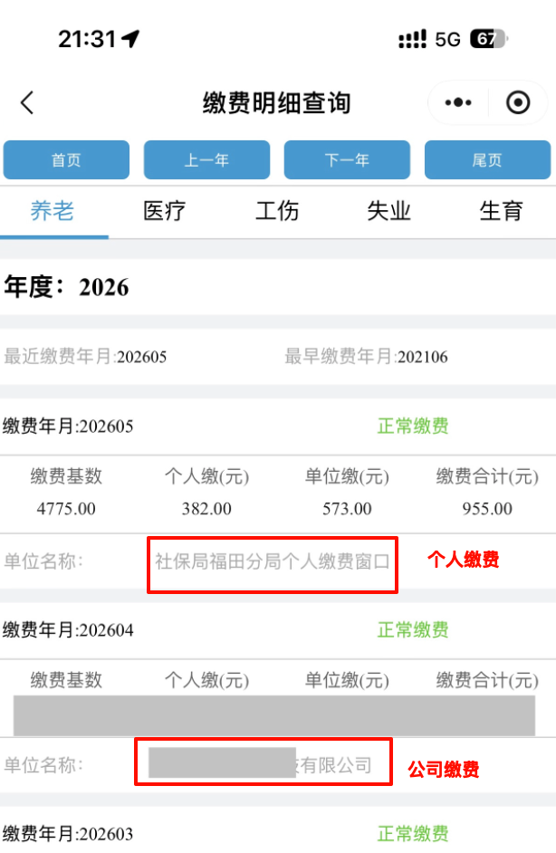

tags:: [[Affairs]]
alias:: [[社会保险]]
---

- ## 社保
	- 险种：
	  logseq.order-list-type:: number
		- 生存相关：
		  logseq.order-list-type:: number
			- [[养老保险]]
			  logseq.order-list-type:: number
			- [[医疗保险]]
			  logseq.order-list-type:: number
		- 工作相关：
		  logseq.order-list-type:: number
			- [[工伤保险]]
			  logseq.order-list-type:: number
			- [[失业保险]]
			  logseq.order-list-type:: number
		- 生育相关：
		  logseq.order-list-type:: number
			- [[生育保险]]
	- 特殊事项：
	  logseq.order-list-type:: number
		- [[灵活就业参保]]
		  logseq.order-list-type:: number
- ## 全国查看社保缴费明细
	- **我的社保卡** 小程序 -> **个人服务查询** -> **社保缴费信息查询**
		- {:height 343, :width 303}
-
-