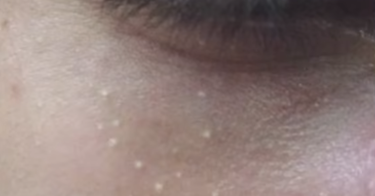
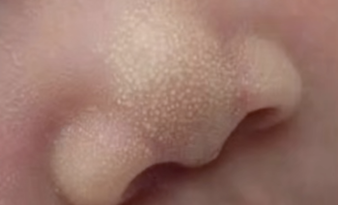
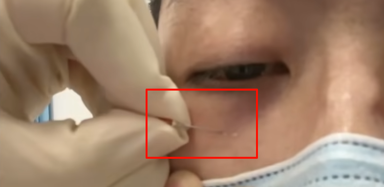

tags:: [[皮肤学]]
---

- ## 啥是粟丘疹
	- 粟丘疹, 是一种良性的表皮样囊肿.
	- 特点:
		- 白色小点.
		  logseq.order-list-type:: number
		- 覆盖有一层表皮.
		  logseq.order-list-type:: number
			- 挑开表皮后, 可以挤出一粒比较硬的白色物质, 名为 **角蛋白** .
	- {:height 239, :width 297}
- ## 危害性
	- 没啥危害, 主要可能是不好看.
- ## 产生原因
	- 发病原因不明, 一般分为 **原发性** 和 **继发性** .
	- **原发性** :
		- 很多新生儿会长, 被称为 **新生儿粟丘疹** .
		- 一般几个月就会消失, 家长不要随意处理.
		- {:height 236, :width 239}
	- **继发性** :
		- **角质细胞** 受到刺激, 分泌过量的角蛋白.
		- 可能的刺激:
			- 阳光照射, 烧伤, 感染, 甚至只是轻微的机械性损伤.
			  logseq.order-list-type:: number
			- 或许眼霜中存在的某种成分有刺激作用 (==只是猜测, 一般认为与眼霜无关, 主要这玩意儿没啥人研究==)
			  logseq.order-list-type:: number
- ## 主要长在眼周的原因
	- 目前猜测, 可能和眼周皮肤结构有关.
- ## 如何处理
	- 不处理, 过一段时间自动脱落.
	  logseq.order-list-type:: number
		- 但是可能很久很久.
	- 用粉刺针挑除.
	  logseq.order-list-type:: number
		- 最好在 **皮肤科** 或者 **眼科** 进行处理.
		- 如果要自己动手, 一定要做好消毒.
		- {:height 366, :width 417}
- ## 参考
	- [【医学博士生】脂肪粒的科普（治疗方法很简单没啥说的主要是帮眼霜洗白](https://www.bilibili.com/video/BV1y5411V7mg/?vd_source=f1fbb083ddef12dcff3388779faac201)
	  logseq.order-list-type:: number
	- [“医生，来个针挑脂肪粒？”——眼下的疙瘩到底是啥？皮肤科医生破解“脂肪粒”真身](https://www.bilibili.com/video/BV1o3411j7kY/?vd_source=f1fbb083ddef12dcff3388779faac201)
	  logseq.order-list-type:: number