tags:: [[Front End]]
---

- ## Reference
	- ### Can I Use
		- [Can I Use](https://caniuse.com/)
		- 查看各个浏览器对前端技术的支持情况
		- 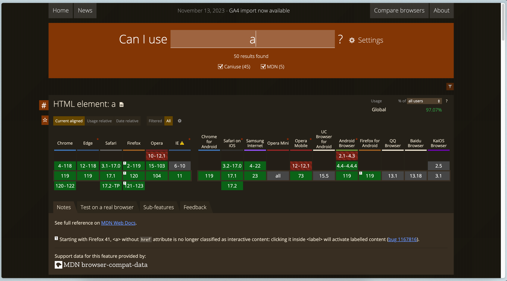
- ## Forum
	- ### Mozilla MDN Discourse
		- [Mozilla MDN Discourse](https://discourse.mozilla.org/c/mdn/236)
		- Mozilla 有关 MDN 内容的论坛
		- 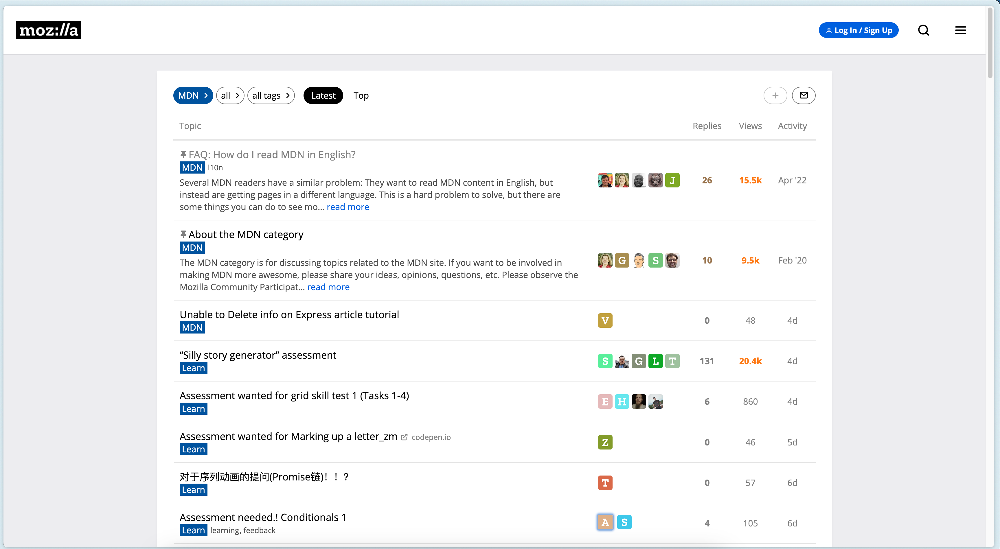
	- ### SitePoint Community
		- [SitePoint Community](https://www.sitepoint.com/community/)
		- SitePoint 网站的论坛
		- 
- ## Playground
	- ### MDN Playground
		- [MDN Playground](https://developer.mozilla.org/en-US/play)
		- 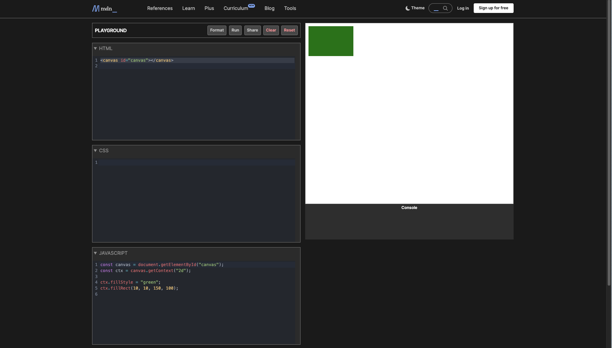
	- ### JS Bin
		- [JS Bin](https://jsbin.com/?html,css,js,output)
		- 前端 Playground, 同时可以引入一些常用库
		- 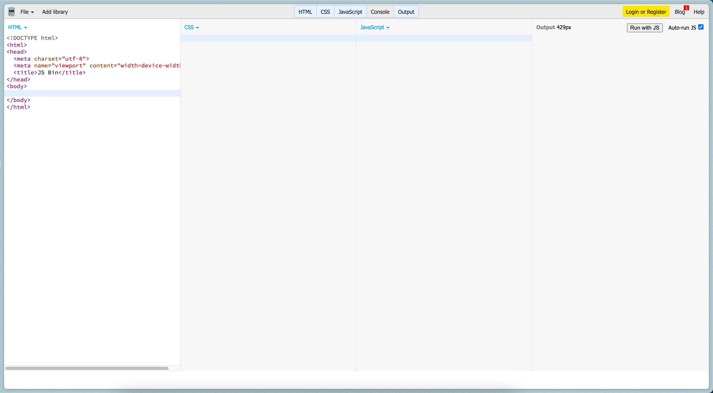
	- ### JS Fiddle
		- [JS Fiddle](https://jsfiddle.net/)
		- 前端 Playground, 同时可以引入一些常用库
		- 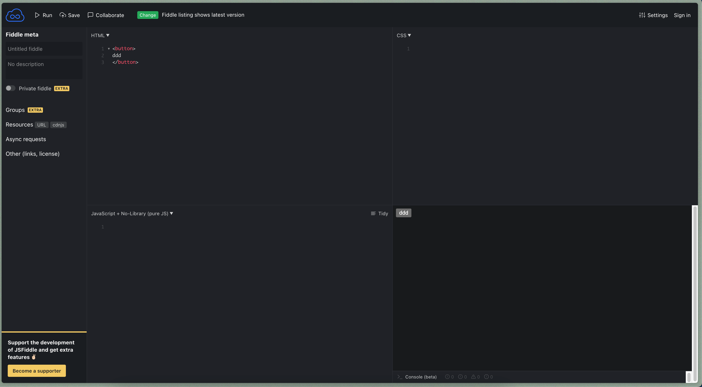
	- ### Code Pen
		- [Code Pen](https://codepen.io)
		- 前端 Playground , 同时可以搜索和查看别人的作品。
		- 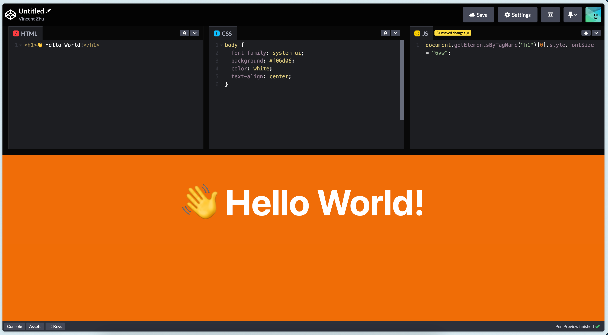
		- 
	- ### CSS Battle
		- [CSS Battle](https://cssbattle.dev/)
		- 针对 CSS 的一些挑战题。
		- 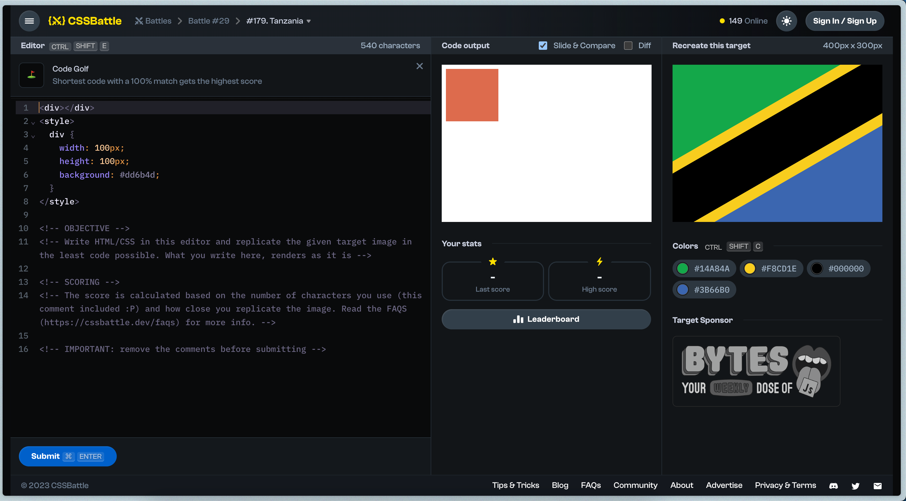
- ## Algorithm
	- ### edabit challenges
		- [edabit challenges](https://edabit.com/)
		- JS 算法题
		- 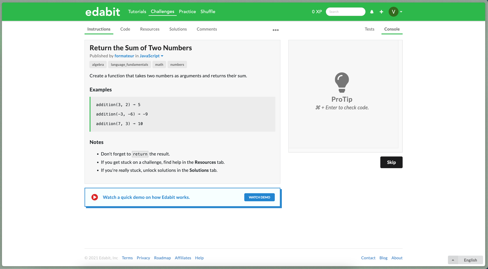
- ## 语法校验
  collapsed:: true
	- ### JSLint
		- [JSLint](https://www.jslint.com/)
		- JS 语法校验工具
		- 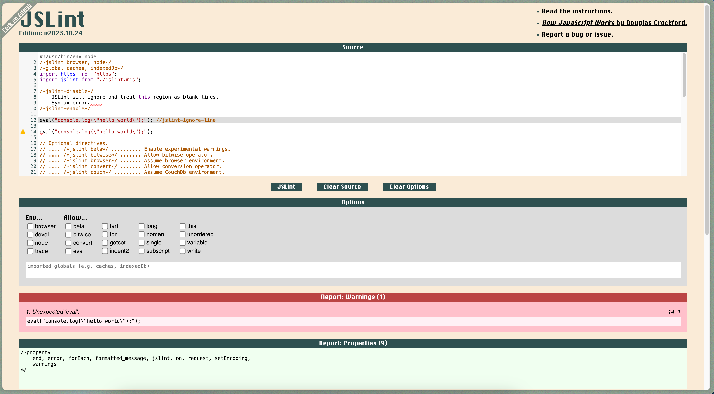
- ## Open Source
  collapsed:: true
	- ### Uiverse
		- [Uiverse](https://uiverse.io/)
		- 有一些好用的开源 UI 代码
		- 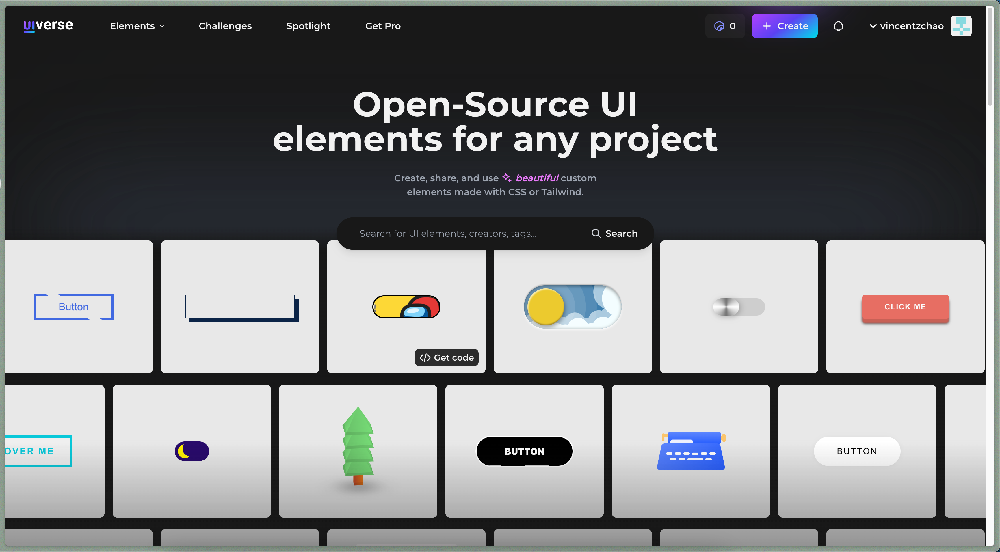
- ## 文本学习资源
  collapsed:: true
	- ### 设计模式
		- #### Patterns
			- [Patterns](https://www.patterns.dev/#patterns)
			- 前端设计模式教程
			- 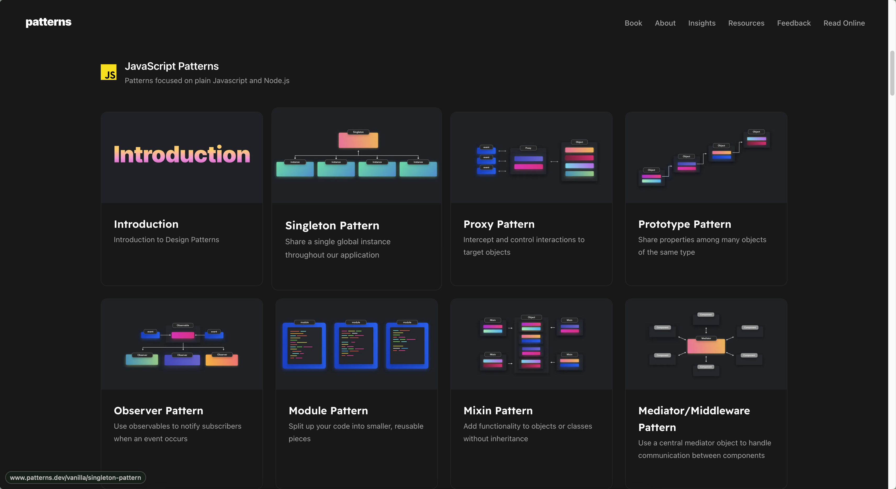
	- ### 权威系统教程
		- #### MDN
			- [MDN](https://developer.mozilla.org/)
	- ### 非权威系统教程
		- #### JAVASCRIPT.INFO
			- [JAVASCRIPT.INFO](https://javascript.info/)
			- javascript 系统教程
			- 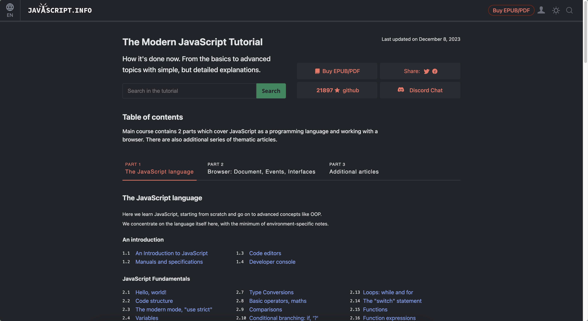
- ## 博客
  collapsed:: true
	- ### Jimmy 知识分享
		- [Jimmy 知识分享](https://www.jimmyxuexue.top/home/)
		- {:height 472, :width 849}
	- ### 被删的前端游乐园
		- [被删的前端游乐园](http://godbasin.com/)
		- 
	- ### 孟坤 Web 实验室
		- [孟坤 Web 实验室](https://lab.ur1.fun/)
		- 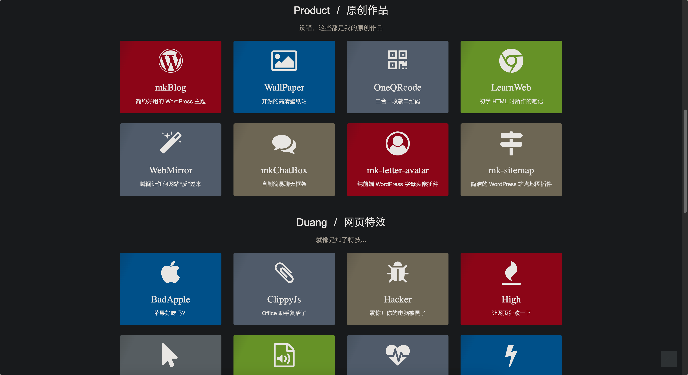
-