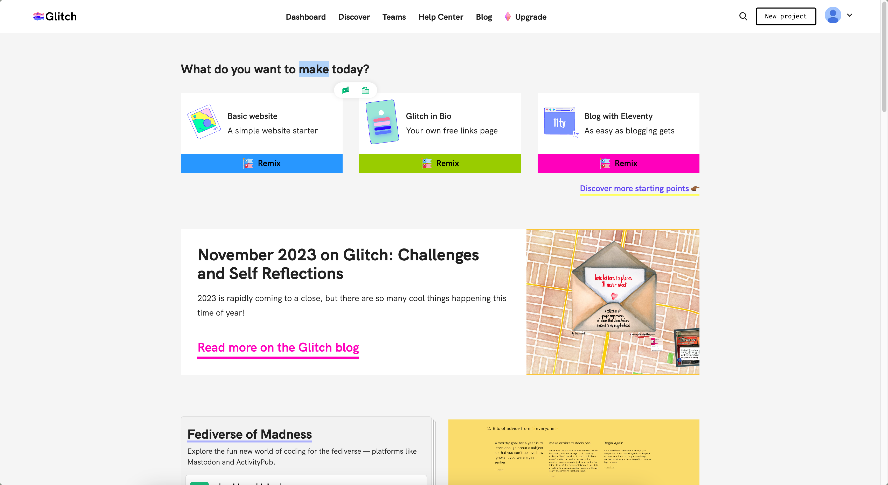
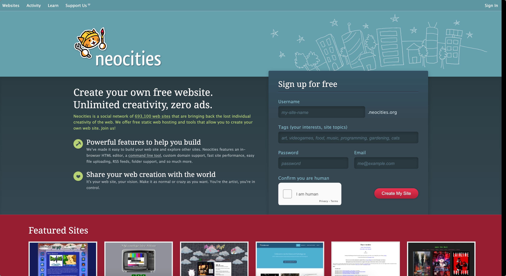
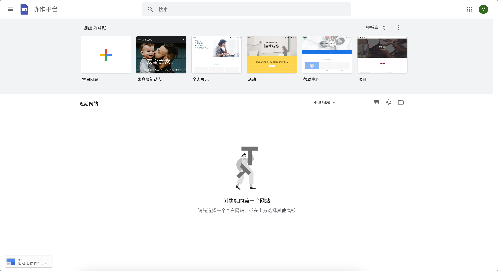

## Glitch
	- [Glitch](https://glitch.com/)
	- 免费托管自建的网站
	- {:height 300, :width 600}
- ## Neocities
	- [Neocities](https://neocities.org/)
	- 托管自建网站，同时可以浏览他人托管的网站。
	- {:height 300, :width 600}
- ## Google 协作平台
	- [Google 协作平台](https://sites.google.com/u/0/new?pli=1&authuser=0)
	- 可以拖拽式生成自己的网页
	- {:height 300, :width 600}
- ## Netlify
	- [Netlify](https://app.netlify.com/)
- ## Vercel
	- [Vercel](https://vercel.com)
	-