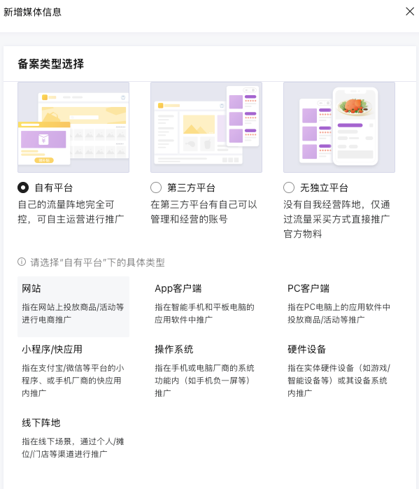
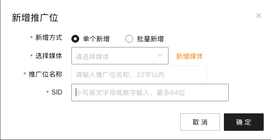

tags:: [[美团联盟]]
---

- ## CPS 相关概念
	- 通读: [[中国 CPS 相关概念]]
- ## 管理媒体
	- [媒体管理](https://media.meituan.com/pc/index.html#/spread/bit)
	  id:: 693bfcb4-a2b5-47d8-aea7-5c7ec0c557d4
	- {:height 544, :width 425}
- ## 管理推广位
	- [推广位管理](https://media.meituan.com/pc/index.html#/spread/promotion)
	- {:height 282, :width 393}
- ## 相关参数
	- 每个 `媒体` 都有 :
		- `媒体 ID`
		  logseq.order-list-type:: number
		- `媒体 AppKey`
		  logseq.order-list-type:: number
		- `媒体 AppSecret`
		  logseq.order-list-type:: number
	- 每个 `推广位` 都有:
		- `推广位 SID`
		  logseq.order-list-type:: number