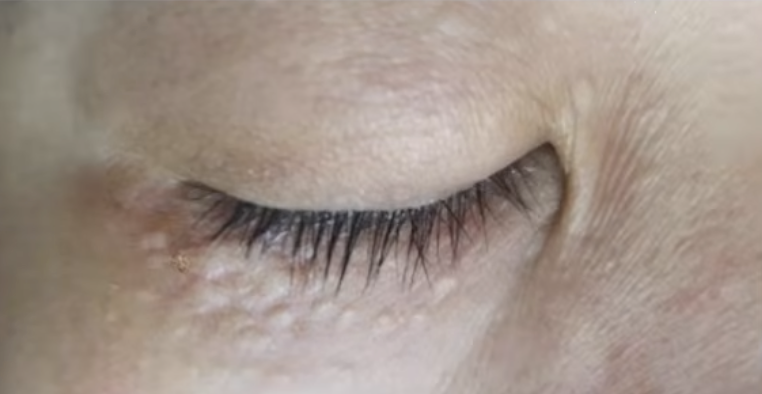
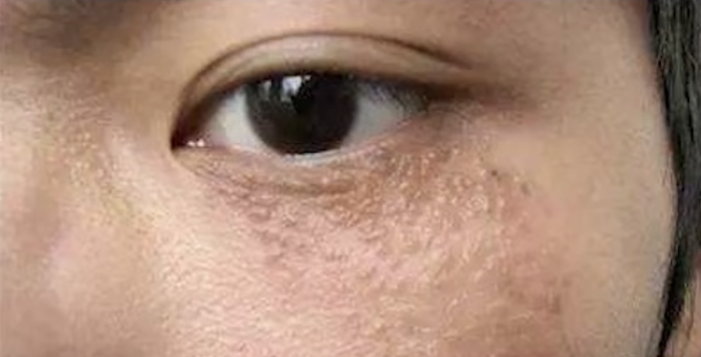
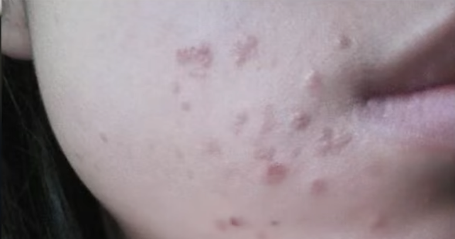

tags:: [[脂肪粒]]
---

- ## 不存在 "脂肪粒"
	- 医学上不存在 "脂肪粒" 这种说法.
	- 大家说的 **脂肪粒** 可能是如下几种.
- ## [[粟丘疹]]
	- 白色小点, 光滑.
	- {:height 239, :width 297}
- ## [[汗管瘤]]
	- 鹅卵石状, 光滑.
	- {:height 343, :width 331}
- ## [[扁平疣]]
	- 有些粗糙, 密集.
	- 眼周
		- {:height 201, :width 324}
	- 脸部有可能长
		- {:height 257, :width 330}
- ## 参考
	- [“医生，来个针挑脂肪粒？”——眼下的疙瘩到底是啥？皮肤科医生破解“脂肪粒”真身](https://www.bilibili.com/video/BV1o3411j7kY/?vd_source=f1fbb083ddef12dcff3388779faac201)
	  logseq.order-list-type:: number
-