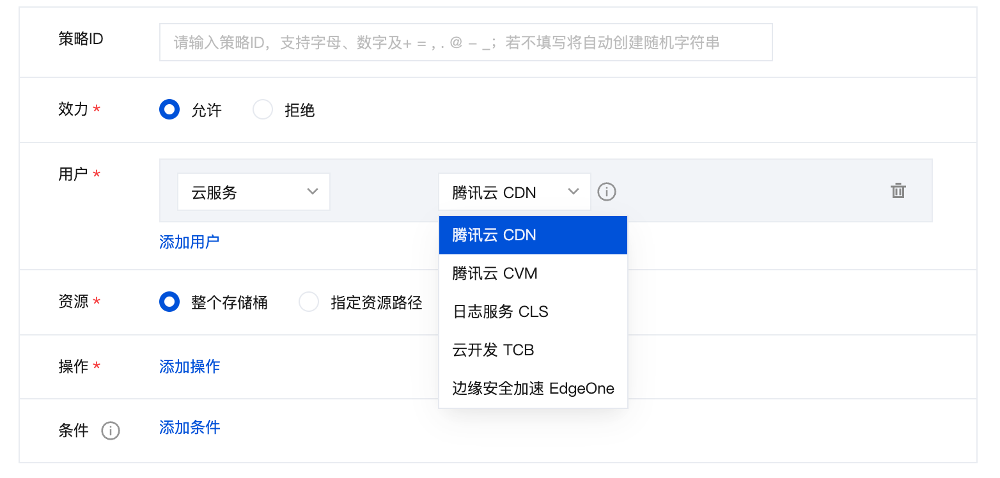
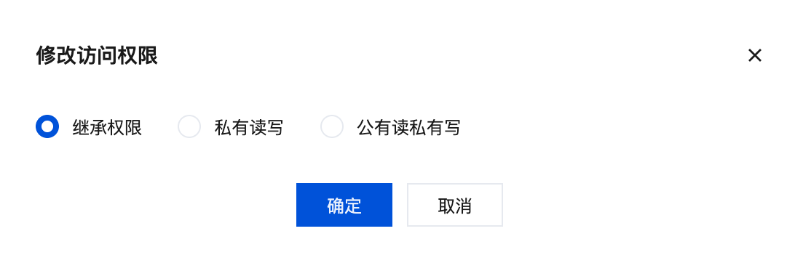
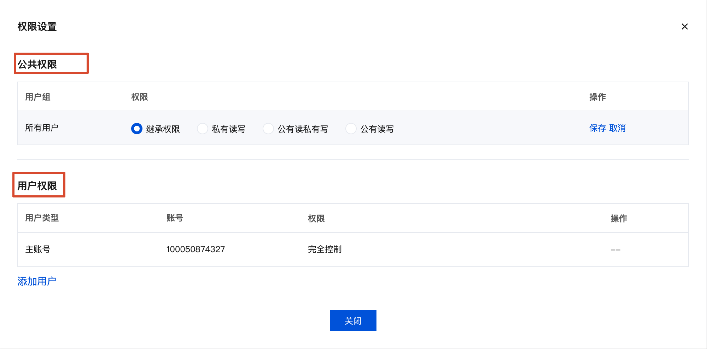

tags:: [[腾讯云 COS]]
---

- ## 存储桶权限
	- ### 如何进入权限管理
		- 进入 [腾讯云 COS - 存储桶列表](https://console.cloud.tencent.com/cos/bucket) -> 选择 **存储桶** -> 点击侧边栏 **权限管理** .
	- ### ACL 权限配置: 公共权限 + 用户权限
		- #### 公共权限
			- 可以配置如下内容:
				- 私有读写 (private):
				  logseq.order-list-type:: number
					- 只有 **腾讯云账号 (包括主账号和子账号)** 可以读写.
					  id:: 6a86b48c-276b-459b-a97e-a1eb4264bf64
				- 公有读, 私有写 (public-read):
				  logseq.order-list-type:: number
					- 非 **腾讯云账号 (包括主账号和子账号)** 只可以读, 只有 **腾讯云账号 (包括主账号和子账号)** 可以写.
				- 公有读写 (public-read-write):
				  logseq.order-list-type:: number
					- 不管是不是 **腾讯云账号 (包括主账号和子账号)** , 都可读写
		- #### 用户权限
			- 单独配置各个 **腾讯云账号 (包括主账号和子账号)** 的访问权限.
	- ### Policy 权限配置
		- 相比 ACL 权限配置:
			- 有更详细的配置规则.
			  logseq.order-list-type:: number
			- 除了 **主账号和子账号** , 还支持配置 **云服务** 对 **存储桶** 的访问权限.
			  logseq.order-list-type:: number
				- 如果 **存储桶** 是 **CloudBase** 创建的, 则默认会配置上 **腾讯云 CDN** 和 **云开发 TCB** 对这个 **存储桶** 的访问权限.
				- 
- ## 目录与文件权限
	- ### 文件权限
		- **文件 (或称对象)** 也可以配置 **ACL 权限** .
		- 但是,
			- 缺少 **用户权限** .
			  logseq.order-list-type:: number
			- **公共权限** 不能配置 **公有读写** .
			  logseq.order-list-type:: number
				- 因为不允许一个 **文件** 可以被匿名访问者 **覆盖/删除** .
		- {:height 162, :width 429}
	- ### 目录权限
		- **目录** 与 **存储桶** 一样, 可以配置 **ACL 权限** .
			- {:height 342, :width 474}
		- 拥有 **目录** 的写权限, 代表可以在目录下 **创建、覆盖、删除对象** .
- ## COS 文件标识
	- ### COS 对象永久地址
		- 格式如: `https://存储桶标识.cos.ap-地域标识.myqcloud.com/文件路径`
	- ### COS 对象临时地址
		- 格式如: `https://存储桶标识.cos.ap-地域标识.myqcloud.com/文件路径?一堆参数`
		- 如果 COS 对象 的权限配置是 **不能公有访问** , 但此时客户端又希望公有访问时 (因为一般不在客户端存放 COS 认证需要的凭证):
			- 生成 **COS 对象临时地址** , 供客户端临时访问.
-