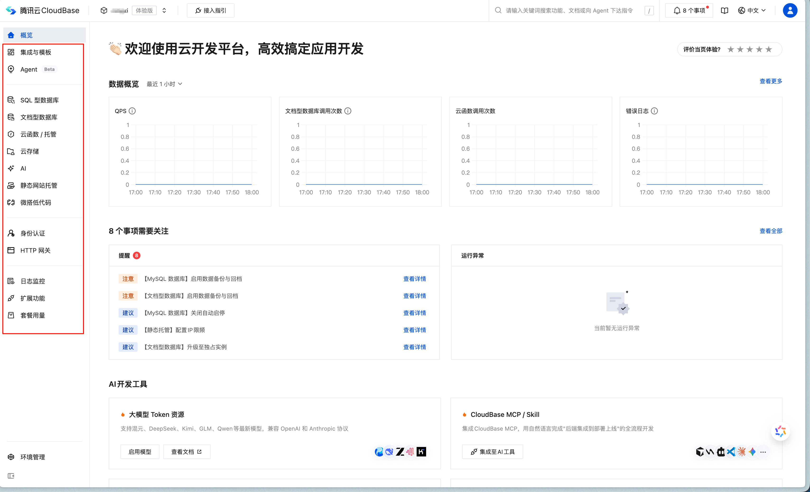

tags:: [[腾讯云 CloudBase]] 
---

- ## 什么是腾讯云 CloudBase
	- **腾讯云 CloudBase** , 英文为 **Tencent CloudBase** (简称为 `TCB` ), 也称为 **云开发 CloudBase** , 或 **CloudBase** .
	- **腾讯云 CloudBase** 是 **腾讯云** 提供的支撑 [[微信云开发]] 的云服务.
	- **腾讯云 CloudBase** 不止能用于构建 **微信生态应用** , 也可以构建 **Web 网站 / 移动 App** 等应用.
- ## 腾讯云 CloudBase 提供的服务
	- CloudBase 提供如下服务: (创建 CloudBase 环境后, 到此处查看: [CloudBase 控制台](https://tcb.cloud.tencent.com/dev))
		- 后端组件 :
		  logseq.order-list-type:: number
			- SQL 型数据库 (MySQL)
			  logseq.order-list-type:: number
			- 文档型数据库 (MongoDB)
			  logseq.order-list-type:: number
			- 云存储 (对象存储)
			  logseq.order-list-type:: number
		- 后端 API :
		  logseq.order-list-type:: number
			- 云函数
			  logseq.order-list-type:: number
			- 云托管 (可托管我们自建的后端服务, 由 [[腾讯云 CloudBase Run]] 提供底层能力)
			  logseq.order-list-type:: number
			- 身份认证 (邮箱/短信/账号密码登录等)
			  logseq.order-list-type:: number
		- 各服务可观测性:
		  logseq.order-list-type:: number
			- 日志监控
			  logseq.order-list-type:: number
		- 静态网站托管
		  logseq.order-list-type:: number
		- AI 能力
		  logseq.order-list-type:: number
		- ...
	- {:height 340, :width 632}
- ## 腾讯云 CloudBase 支持 AI 原生开发
	- 腾讯云 CloudBase 提供了 MCP 和 Skills , 以搭配 AI Agent 进行开发 .
- ## 腾讯云 CloudBase 计费
	- 参见: [腾讯云 CloudBase 购买指南](https://cloud.tencent.com/document/product/876/127357)
- ## 腾讯云 CloudBase 相关网站
	- [CloudBase 控制台](https://tcb.cloud.tencent.com/dev)
	  logseq.order-list-type:: number
	- 文档:
	  logseq.order-list-type:: number
		- [CloudBase 开发文档](https://docs.cloudbase.net/)
		  logseq.order-list-type:: number
		- [腾讯云文档中心 - 云开发 CloudBase](https://cloud.tencent.com/document/product/876)
		  logseq.order-list-type:: number
	- [CloudBase 官网 (无需关注)](https://tcb.cloud.tencent.com/)
	  logseq.order-list-type:: number
	- [腾讯云 CloudBase 产品主页 (无需关注)](https://cloud.tencent.com/product/tcb)
	  logseq.order-list-type:: number