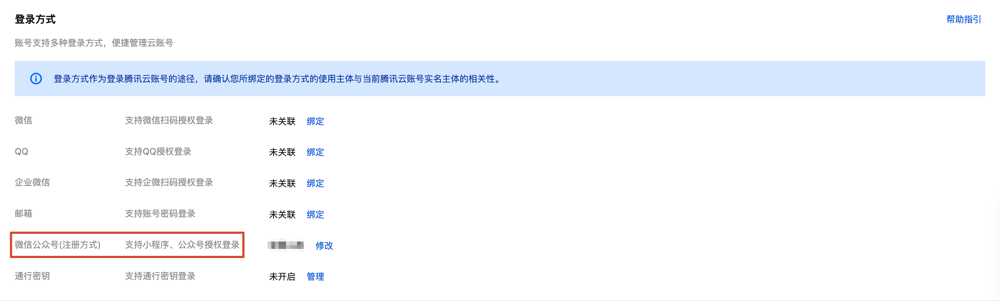
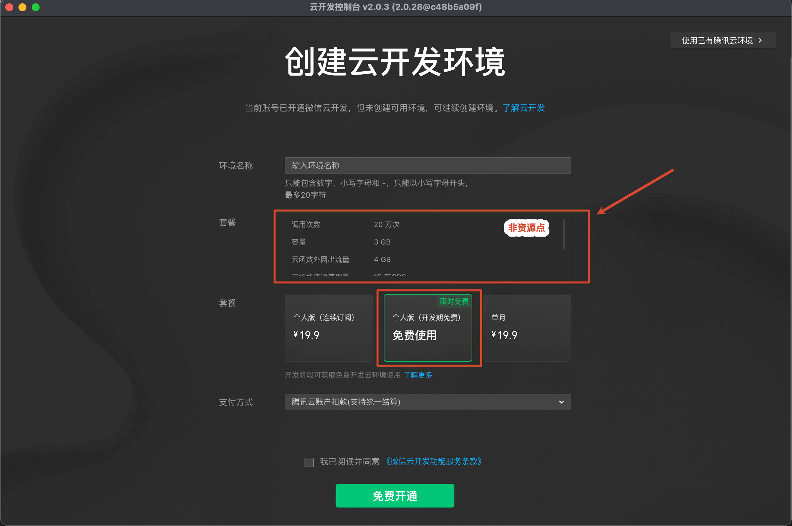
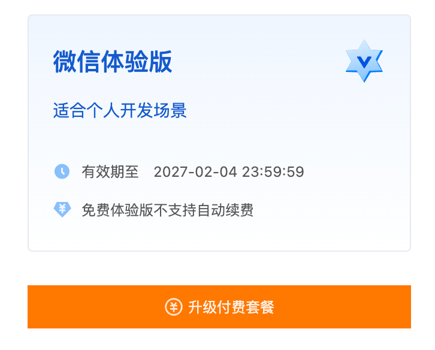
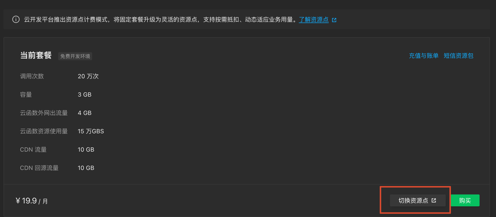
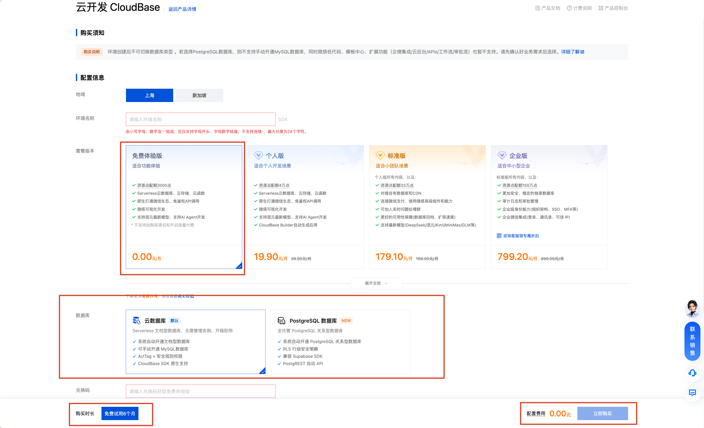
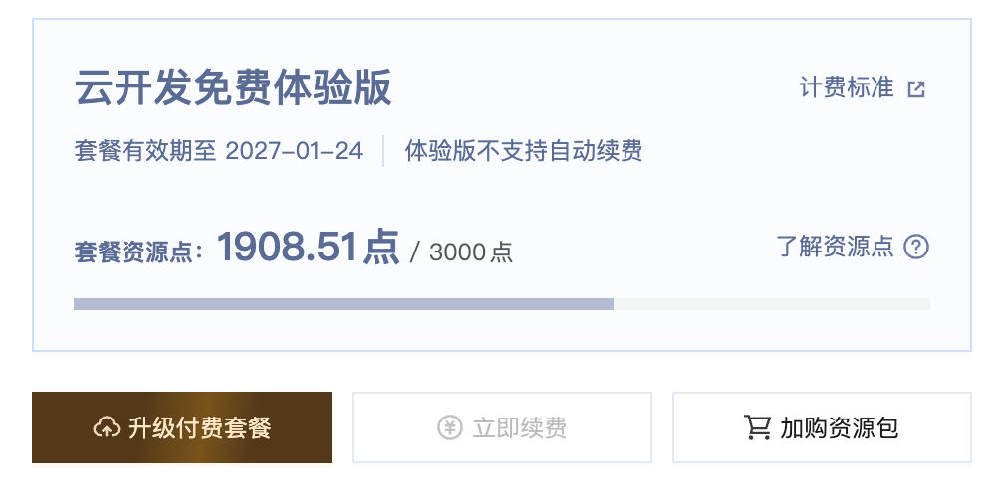
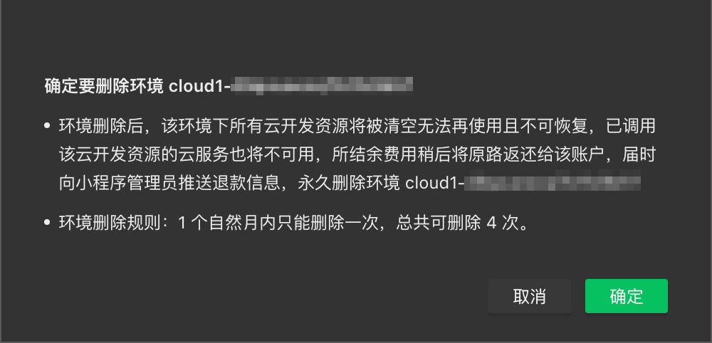
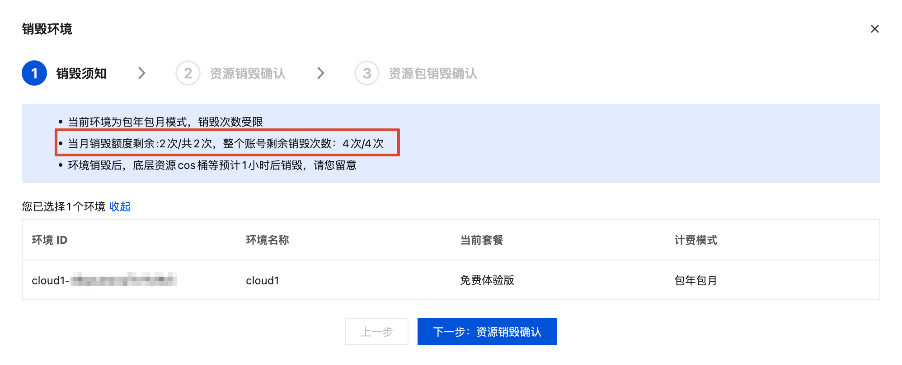

tags:: [[腾讯云 CloudBase]], [[微信云开发]]
---

- ## 云环境
	- ### 什么是云环境
		- **云环境** 是 CloudBase 的 **资源隔离单位** 与 **计费单位** , 每个环境内包含一整套独立的资源.
	- ### 云环境 ID
		- 每个 **云环境** 都有一个 `ID` , 在调用时需要用到.
		- 在 **微信开发者工具** 的 `Network` 面板中, 可以查看 `环境 ID` 请求头.
	- ### 云环境运行模式
		- **PG 模式** : 创建时选择 **PostgreSQL 数据库** .
			- 身份认证、云存储、权限模型由 PostgreSQL 统一承载. (详见: [[腾讯云 CloudBase: PG 模式]] )
		- **传统模式** : 创建时未选择 **PostgreSQL 数据库** .
- ## 创建云环境方式
	- ### 从微信开发者工具创建 (不支持 PG 模式)
		- 点击 **微信开发者工具** 右上角的 **云开发** 进行开通 (默认不创建 **SQL 型数据库** 实例)
	- ### 从腾讯云 CloudBase 控制台创建 (可选 PG 模式)
		- 进入 CloudBase 控制台, 创建新环境, 需要选择创建 **MySQL 实例** 还是 **PostgreSQL 实例** .
	- ### 调用 `CreateEnv` 云 API 创建
		- 参见: [`CreateEnv` 云 API](https://cloud.tencent.com/document/product/876/128592)
		- 适合 **多租户** 的场景.
- ## 云账号
	- ### 什么是云账号
		- 即 **腾讯云侧** 的 **账号** .
		- 开通 **云账号** 的方式:
			- 直接在 **腾讯云侧** 开通 **账号** .
			  logseq.order-list-type:: number
			- 每个开通了 [[微信云开发]] 的 **微信公众平台应用 (小程序/小游戏/公众号/服务号)** 都会在 **腾讯云** 创建一个对应的 **云账号** .
			  logseq.order-list-type:: number
				- 在 **微信开发者工具** 开通.
			- 每个开通了 [[微信云托管]] 的 **微信公众平台应用 (小程序/小游戏/公众号/服务号)** 都会在 **腾讯云** 创建一个对应的 **云账号** .
			  logseq.order-list-type:: number
				- 在 **[微信云托管官网](https://cloud.weixin.qq.com/cloudrun)** 开通.
		- ==注销 **微信公众平台应用** , 并不会注销其关联的 **云账号** , 但会导致 **云账号** 无法使用 **微信公众平台应用**  登录, 所以需要事先绑定其它登录方式==
	- ### 绑定与解绑
		- 如果是先在 **腾讯云侧** 创建了 **云账号** , 则可以在 [腾讯云 - 账号信息](https://console.cloud.tencent.com/developer) 将 **云账号** 与指定 **微信公众平台应用** 绑定.
			- 也可以在 [腾讯云 - 账号信息](https://console.cloud.tencent.com/developer) 将 **云账号** 与 **微信公众平台应用** 解绑.
			- 注意: 一个 **云账号** 只能绑定一个 **微信公众平台应用** .
		- {:height 217, :width 685}
- ## 创建免费体验环境 (2026.08.06)
	- ### 从微信开发者工具创建 (旧套餐)
		- 参考:
			- [云开发 CloudBase - 购买指南 - 资源点价格文档](https://cloud.tencent.com/document/product/876/127357)
			  logseq.order-list-type:: number
			- [云开发 - 计费相关 - 计费说明](https://developers.weixin.qq.com/miniprogram/dev/wxcloudservice/wxcloud/billing/price.html)
			  logseq.order-list-type:: number
			- [云开发 - 资源点新计费模式](https://developers.weixin.qq.com/miniprogram/dev/wxcloudservice/wxcloud/billing/Billing_Instructions.html)
			  logseq.order-list-type:: number
		- #### 创建免费环境
			- 如果 **没有云环境** 或者 **云环境已经销毁超过 1 个月** :
				- 则可以在 **微信开发者工具** 开通一个的 **免费体验环境** .
				- ==活动结束时间为: 2026 年 12 月 31 日==
			- {:height 680, :width 657}
		- #### 查看 CloudBase 控制台
			- 进入 CloudBase 控制台查看 **套餐用量** , 发现长这样:
				- {:height 244, :width 249}
		- #### 免费环境说明
			- **免费期限为 6 个月** .
			  logseq.order-list-type:: number
			- 提供固定配额的资源 (不是资源点).
			  logseq.order-list-type:: number
			- **免费体验环境** 会在 **小程序发布** 后的第 15 天自动到期 (若需继续使用, 需转为付费)
			  logseq.order-list-type:: number
			- 在 **免费体验环境**  **销毁** 后, 可以立即 (不用等 1 个月) 重新创建新的 **免费体验环境** .
			  logseq.order-list-type:: number
		- #### 切换资源点计费
			- 这个属于 **旧版免费体验套餐** , 给各项资源 **基础配额 (调用次数/容量等)**  (而不是最新的 **资源点计费模式** ) .
			- 若需切换为 **资源点计费模式** , 直接点击 **切换资源点** 无效:
				- 需要先在 **云开发控制台** 或 **CloudBase 控制台** ,  付费购买 **付费套餐 (个人版/标准版等)** , 再点击 **切换资源点** .
			- 
	- ### 从 CloudBase 控制台创建
		- 参考:
			- [云开发 CloudBase - 购买指南 - 资源点价格文档](https://cloud.tencent.com/document/product/876/127357)
			  logseq.order-list-type:: number
		- #### 创建免费环境
			- 每个 **腾讯云账号** 可以在 **[CloudBase 控制台](https://tcb.cloud.tencent.com/dev)** , 创建一个 **免费体验环境** .
			- {:height 563, :width 860}
		- #### 查看 CloudBase 控制台
			- 进入 CloudBase 控制台查看 **套餐用量** , 发现长这样:
				- {:height 367, :width 477}
		- #### 免费环境说明
			- **免费期限为 6 个月** .
			  logseq.order-list-type:: number
			- 提供 **3000 资源点/月** .
			  logseq.order-list-type:: number
			- **免费体验环境** 到期前 **1 个月内** 可以免费手动续期 6个月 (不会自动续期) .
			  logseq.order-list-type:: number
			- **免费体验环境** 会在 **小程序发布** 后的第 15 天自动到期 (若需继续使用, 需转为付费)
			  logseq.order-list-type:: number
			- 在 **免费体验环境**  **到期 / 转为付费 / 销毁** 后, 可以立即重新创建新的 **免费体验环境** .
			  logseq.order-list-type:: number
	- ### 免费环境说明
		- 不管是从哪里创建的, 同一云账号, 只能同时存在一个 **免费环境** .
		  logseq.order-list-type:: number
		- 免费环境都存在功能限制.
		  logseq.order-list-type:: number
		- 微信开发者工具 创建的免费环境: 在 **到期 / 转为付费 / 销毁** 后, 可以立即重新创建新的 **免费体验环境** (不管是从 微信开发者工具 创建, 还是从 CloudBase 控制台 创建) .
		  logseq.order-list-type:: number
		- ==问题:==
			- CloudBase 控制台 创建的免费环境: 在 **到期 / 转为付费 / 销毁** 后, 可以立即重新创建新的 **免费体验环境** 吗?
			  logseq.order-list-type:: number
			- 公众号网页是否有上线的概念? 如果没有, 那公众号网页开通的免费环境, 岂不是可以一直免费续期?
			  logseq.order-list-type:: number
				- ==AI 说可以一直免费使用==
- ## 销毁云环境
	- **云开发控制台** 销毁 :
		- {:height 326, :width 521}
		- 一个月内只能销毁 1 次, 一个 **云账号** 总共可销毁 4 次.
	- **CloudBae 控制台** 销毁 :
		- {:height 337, :width 711}
		- 一个月内只能销毁 2 次, 一个 **云账号** 总共可销毁 4 次.
	- ==两处描述不一致==
- ## 一个云账号配多个云环境
	- CloudBase 官方建议: 一个云账号下, 创建三个云环境.
		- **开发环境 (dev)** : 本地测试
		  logseq.order-list-type:: number
		- **测试环境 (staging)** : QA 回归、灰度验证.
		  logseq.order-list-type:: number
		- **生产环境 (prod)** : 线上正式流量.
		  logseq.order-list-type:: number
	- 建议在 **客户端** 通过 **配置文件** 或 **构建变量** 注入 **云环境 ID** , 避免硬编码.
- ## 管理环境的方式
	- CLI: [[CloudBase CLI]]
	  logseq.order-list-type:: number
	- Node.js SDK: [[CloudBase Manager Node SDK]]
	  logseq.order-list-type:: number
	- HTTP: [[CloudBase Cloud API]]
	  logseq.order-list-type:: number
- ## 参考
	- CloudBase 文档:
	  logseq.order-list-type:: number
		- [CloudBase 快速开始 - 云开发环境介绍](https://docs.cloudbase.net/quick-start/env-overview)
		  logseq.order-list-type:: number
		- [CloudBase 快速开始 - 创建云开发环境](https://docs.cloudbase.net/quick-start/create-env)
		  logseq.order-list-type:: number
	- 微信云开发文档:
	  logseq.order-list-type:: number
		- [微信云开发 - 基础概念 - 重要概念 - 环境](https://developers.weixin.qq.com/miniprogram/dev/wxcloudservice/wxcloud/basis/concepts/environment.html)
		  logseq.order-list-type:: number
		- [微信云开发 - 基础概念 - 重要概念 - 账号](https://developers.weixin.qq.com/miniprogram/dev/wxcloudservice/wxcloud/basis/concepts/account.html)
		  logseq.order-list-type:: number
-