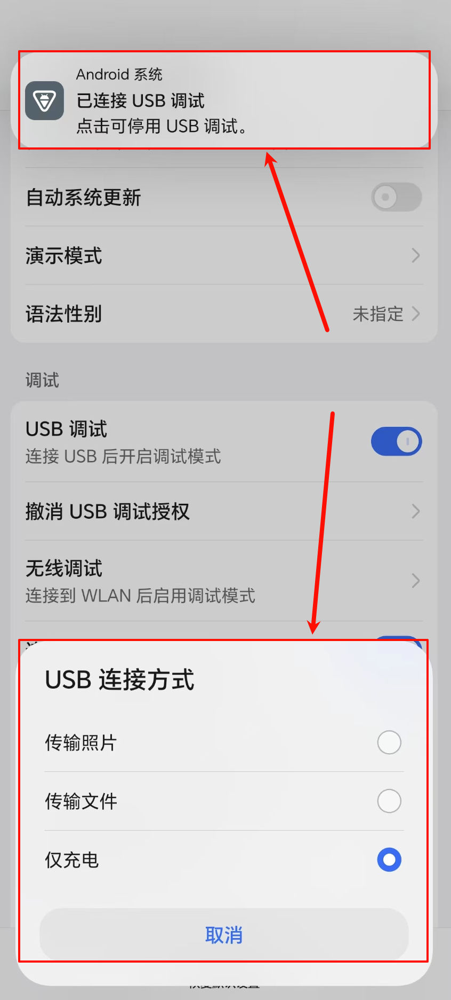
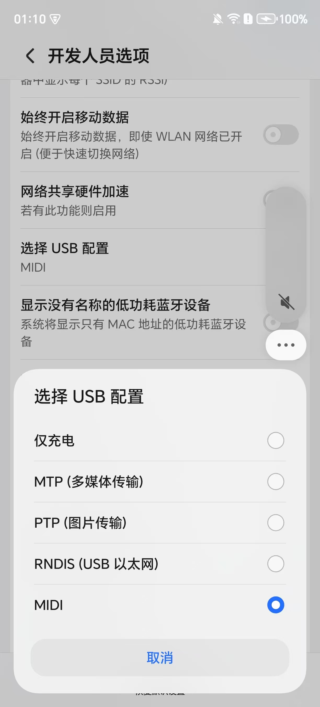
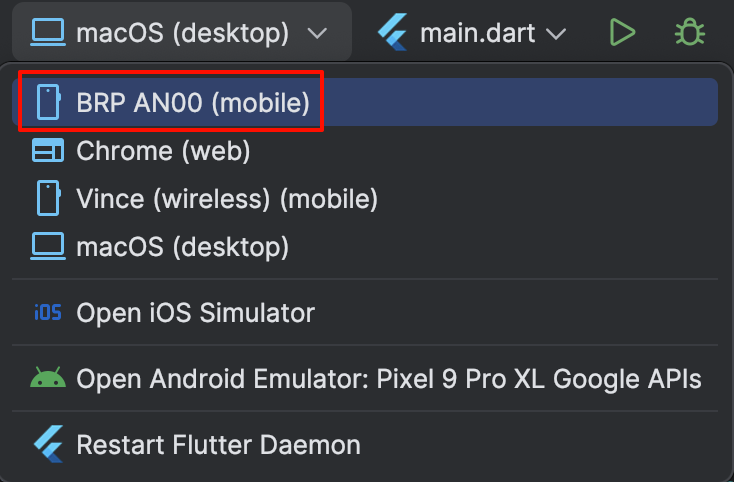

tags:: [[Android]], [[MagicOS]]
---

- ## 开启开发人员选项
	- 一切的前提是, 开启 **开发人员选项**
		- 进入 **设置** -> **关于手机** -> 连续点击 7 次 **版本号** .
		  logseq.order-list-type:: number
		- 进入 **设置** -> **系统和更新** -> **开发人员选项** , 确保: **开发人员选项** 开关是开着的.
		  logseq.order-list-type:: number
- ## USB 调试
	- ### 1. 开启 **USB 调试**
		- 进入 **开发人员选项** -> 开启 **USB 调试** .
	- ### 2. 开启 **连接 USB 时总是弹出提示**
		- 进入 **开发人员选项** -> 开启 **连接 USB 时总是弹出提示** .
		- 这是为了保证, 每次连接 USB 时, 都会弹框提示.
			- 但, 实测, 开启之后, 并不是每次连接都会弹框 ( ==也可能是因为我的线不是原装?== )
			- ==聊胜于无, 还是开着吧.==
	- ### 3. 使用 **USB 数据线** 连接手机与电脑
		- 实测, 貌似并非所有数据线都可以.
			- 我试了好几根线, 只有移动硬盘的线可用.
		- 注意: ==若要尝试插拔设备, 在连接之前, 请确保上述所有选项没有被自动关闭.==
	- ### 4. 手机出现弹框
		- 一定概率会出现 **顶部弹框** 和 **底部弹框** .
			- {:height 582, :width 240}
		- 这可以用来判断 **USB 数据线** 是否有效.
			- 有效, 则有概率会弹框.
			- 无效, 则永远不会弹框.
		- **顶部弹框:**
			- 点击 **顶部弹框** , 只是会进入到 **开发人员选项** 中, 没有其他作用.
		- **底部弹框:**
			- 可以配置 **USB 连接方式** , 可以不在这里配置, 进入下一步.
	- ### 5. 选择 USB 配置
		- 进入 **设置** -> **系统和更新** -> **开发人员选项** -> 点击 **选择 USB 配置** .
		  logseq.order-list-type:: number
			- 上述 **底部弹框** 的 **USB 连接方式** 与这里的 **USB 配置** 一致, 只是选项更少.
		- 出现如下弹框选项:
		  logseq.order-list-type:: number
			- {:height 1362, :width 246}
			- 仅充电
			  logseq.order-list-type:: number
				- 就是 **底部弹框** 的 **仅充电**
			- MTP (多媒体传输)
			  logseq.order-list-type:: number
				- 就是 **底部弹框** 的 **传输文件**
			- PTP (图片传输)
			  logseq.order-list-type:: number
				- 就是 **底部弹框** 的 **传输图片**
			- RNDIS (USB 以太网)
			  logseq.order-list-type:: number
			- MIDI
			  logseq.order-list-type:: number
		- 选择 **RNDIS (USB 以太网)** .
			- 可以确定, **仅充电** 选项, 是不行的.
			- ==其他选项未做验证==
- ## 查看是否已连接
	- ### 使用 `adb devices` 命令
		- ``` zsh
		  ➜  ~ adb devices
		  List of devices attached
		  xxxxxxxxxxxxx        device
		  ```
		- `xxxxxxxxxxxxx` 是手机的 **序列号** , 可在 **设置** -> **关于手机** -> **状态信息** -> **序列号** 查看.
	- ### 使用 `flutter devices` 命令
		- ``` zsh
		  ➜  ~ flutter devices
		  
		  Found 3 connected devices:
		    BRP AN00 (mobile) • xxxxxxxxxxxxx • android-arm64  • Android 15 (API 35)
		    macOS (desktop)   • macos         • darwin-arm64   • macOS 15.5 24F74 darwin-arm64
		    Chrome (web)      • chrome        • web-javascript • Google Chrome 144.0.7559.133
		  ```
		- `BRP AN00` 即设备型号, 可在 **设置** -> **关于手机** -> **型号** 查看.
		- `xxxxxxxxxxxxx` 是手机的 **序列号** , 可在 **设置** -> **关于手机** -> **状态信息** -> **序列号** 查看.
	- ### Android Studio 顶部设备列表
		- {:height 316, :width 386}
		- `BRP AN00` 即设备型号, 可在 **设置** -> **关于手机** -> **型号** 查看.
		- 如果没有, 可以尝试点击 `Restart Flutter Daemon` 刷新.
		-